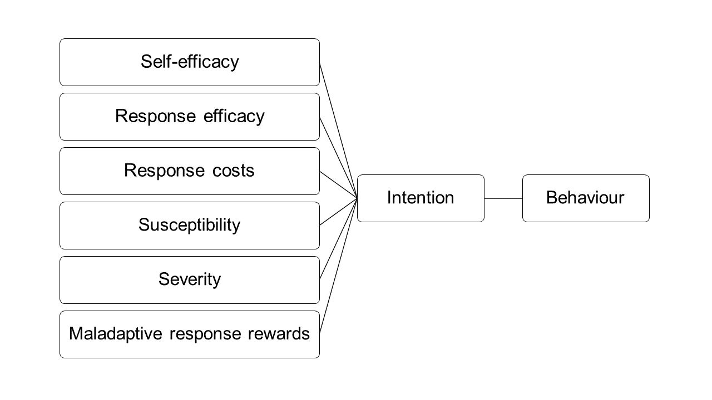

```{r load_packages, include = FALSE}
library("papaja")
library(knitr)
library(dplyr)
library(psych)
```


```{r setglobal, cache = FALSE, include = TRUE}

opts_knit$set(root.dir = "..")

options(knitr.kable.NA = '')
```

```{r results="asis"}
dat <- readr::read_rds(here::here("data", "dat.rds"))

climate <- dat %>% 
  filter(study=="Climate Change")

```


Anthropogenic climate change represents an existential threat to humanity [@ipcc2018]. Consumption of fossil fuels is the most influential factor in the changing climate [@hook2013]. Large-scale reductions in fossil fuel consumption could lead to substantial reductions in total greenhouse emissions [@dietz2009household]. Individual change will not meet emissions targets alone, but are an important response to climate change [@dietz2009household]. Unfortunately, individual fossil fuel consumption remains high [@iea2017]. While structural barriers such as cost and feasibility influence use, investigating the psychological processes that underlie consumption may aid development of interventions to increase climate-friendly behaviours [@clayton2015]. Theories of persuasive communication may provide one useful avenue for understanding this behaviour [@cismaru2011].
 
## Protection Motivation theory

According to PMT, behaviour is determined by the two parallel cognitive processes - coping appraisal and threat appraisal [see Figure \@ref(fig:pmt); @rogers1975; @norman2015]. Coping appraisal is determined by three constructs: response efficacy (perceived effectiveness of behaviour in averting a threat); self-efficacy (perceived ability to perform the behaviour); and response costs [perceived costs and barriers associated with behaviour adoption; @norman2015]. Coping efficacy is maximised when response costs are low but response efficacy and self-efficacy are high. Threat appraisal is determined by three constructs: threat severity (perceived seriousness of the threat); susceptibility (perceived vulnerability to the threat); and maladaptive response rewards [perceived benefits of engaging in a maladaptive response such as avoidance or denial; @norman2015]. Threat appraisal is maximised when maladaptive response rewards are low but susceptibility and severity are high. Intention increases as a function of both threat and coping appraisals [@norman2015].

```{r pmt, echo=FALSE, fig.cap="Protection Motivation Theory", out.width = '100%'}

```


Despite calls for experimental tests of psychological theory within environmental and conservation psychology [e.g. @kidd2019; @nelson2011], few studies have sought to test causal connections between PMT constructs and intention within this domain [@kothe2019]. This is despite frequent recommendations for the use of PMT in designing pro-environmental campaigns [see @cismaru2011; @nelson2011; @scharks2016].

Previous work shows that PMT-based messages can be effective in changing beliefs [@floyd2000; @milne2000]. By investigating messages that elicit change in different PMT constructs, researchers have identified messages types most effective at increasing a given behaviour [e.g. @pechmann2003convey]. However, as yet no studies have systematically investigated the impact of messages targeting different PMT constructs within any pro-environmental behaviour. 

## The current study

We used short messages to systematically investigate the impact of messages that target PMT constructs on intention to reduce fossil fuel consumption. Each message targeted a single PMT construct and the impact of each construct on intention and its target construct was examined.

## Hypotheses 
1. The primary outcome is intention to reduce fossil fuel consumption. It is hypothesised that intervention messages will increase intention relative to control.  
2. The secondary outcomes are the PMT constructs. It is hypothesised that intervention messages targeting a given PMT construct will affect that construct relative to control. Specifically, relative to control the: 
    a. response cost message will decrease perceived response cost 
    b. maladaptive response rewards message will decrease perceived maladaptive response rewards  
    c. response efficacy message will increase perceived response efficacy 
    d. severity message will increase perceived severity 
    e. susceptibility message will increase perceived susceptibility 
    f. self-efficacy message will increase self-efficacy 

# Methods
This study was pre-registered using the template developed by @van2016pre [https://osf.io/2g6bq/](https://osf.io/2g6bq/).

## Participants

Participants were recruited via Amazon MTurk to take part in a study entitled "Short study of responses to messages about scientific issues" in exchange for $1.10USD in Amazon credit.  Sample size was determined *a priori*, we aimed to recruit a minimum of 526 participants per cell in order to detect an effect of d =.2, with 80% power and alpha of 0.0083. To account for missingness, we oversampled each cell by 20, leading to recruitment target of 546 per condition and a total recruitment target of 3822. After removal of duplicate and incomplete submissions, `r printnum(nrow(climate))` participants were included in this study. 

Gender was manually categorised from free-text responses. Four responses could not be categorised (i.e. they did not appear to reflect gender identity: "%" or "40"). Three participants reported an age below the allowed age for registration on MTurk or above 200 years. For both gender and age, these problematic values were converted to missing but data were otherwise retained. See Table \@ref(tab:demo) for a summary of participant characteristics. 

```{r demo, results='asis', warning=FALSE}

climate <- climate %>% 
  labelled::set_variable_labels(
    age = "Age in years",
    education = "Highest level of education",
    gender = "Gender",
    household_income = "Annual household income", 
    ideology_general = "Ideology - General", 
    ideology_economic = "Ideology - Economic",
    ideology_social = "Ideology - Social")

climate <- climate %>% 
  mutate(gender = factor(gender))

tab <- tableone::CreateTableOne(vars = c("age", 
                             "education",
                             "gender",
                             "household_income", 
                             "ideology_general", 
                             "ideology_economic", 
                             "ideology_social"), 
                    data = climate, test = FALSE)

tab <- print(tab, varLabels = T, printToggle = FALSE)

papaja::apa_table(tab, caption="Demographic characteristics of participants", longtable = TRUE)
```


## Procedure

Participants completed an online questionnaire that included all measures and the experimental manipulation via Qualtrics.

The first component of the questionnaire included demographic items. Participants were then randomly allocated (by Qualtrics) to one of the six intervention groups or control. Individuals allocated to receive an intervention message were shown a message related instruction and then the target message. Individuals in the control group did not receive the instruction or message and instead proceeded directly to the next part of the survey. Participants were not notified of their condition. In the third part of the questionnaire, participants completed the PMT questionnaire. The order of items within the PMT questionnaire was randomised to reduce order effects. At the conclusion of the study participants were invited to provide feedback on the survey via a free-text response box.

Data for this project was collected concurrently with data for a second project (described at [http://osf.io/87kwb](http://osf.io/87kwb)). Each participant took part in only one project. Although the projects were not intended to be analysed or reported together, their structural similarity could cause unexpected effects for participants who participated in both (e.g. unblinding). The intention to analyse and report the studies separately was documented in the pre-registration.

## Messages

Participants were randomised to receive one of six intervention messages or to a no message control group. Each intervention message was designed to target a single PMT construct.\footnote{A set of 24 candidate messages (4 per PMT construct) were first developed by EJK and ML and reviewed by BAM. These messages were then tested in a pilot study with a convenience sample of 655 Australian adults. Participants in the pilot study viewed a single candidate message relating to climate change and/or fossil fuel usage and responded to a single item measure related to the construct the measure was intended to target (e.g. a severity message and a single item measure of severity). The mean response was calculated for each candidate message, the candidate message with the largest (or smallest in the case of maladaptive response rewards and response costs) mean value on the construct measure was chosen for use within this study.}  

- "*The climate is changing. Climate change will lead to serious consequences in the United States including increased and more prolonged drought. Climate change is already contributing to water shortages around the globe.*" - Severity
- "*The climate is changing. These changes put everyone at risk. Whether or not you realize it, climate change is already affecting your life, by making extreme weather events more frequent and increasing food prices.*" - Susceptibility
- "*The climate is changing. Some people believe that climate change will lead to a more comfortable climate due to higher average daytime temperatures, but researchers agree that even in developed countries changes to our climate will disrupt basic necessities like food, clean air, and clean water.*" - Maladaptive Response Rewards
- "*We need to reduce our use of fossil fuels in order to reduce the risks of climate change. Many households can save hundreds of dollars each year simply by installing more efficient lights. Small changes like this make a difference and allow you to save money and help the environment at the same time.*" - Response Efficacy
- "*We need to reduce our use of fossil fuels in order to reduce the risks of climate change. Reducing your fossil fuel dependence is easy. You can change your use of fossil fuels with lots of little steps by driving less or doing one big load of laundry rather than multiple small loads.*" - Self-Efficacy
- "*We need to reduce our use of fossil fuels in order to reduce the risks of climate change. It doesn't take a lot of time and effort to reduce your fossil fuel usage, you can do something as simple as changing your electricity supply to one using more renewable energy sources.*" - Response Costs

## Measures

```{r reli}
mrr <- select(climate, cc_mrr_1, cc_mrr_2,cc_mrr_3)
re  <- select(climate, cc_re_1, cc_re_2,cc_re_3)
se <- select(climate, cc_se_1, cc_se_2, cc_se_3)
rc <- select(climate, cc_rc_1, cc_rc_2, cc_rc_3)
sus <- select(climate, cc_sus_1, cc_sus_2, cc_sus_3)
sev <- select(climate, cc_sev_1, cc_sev_2, cc_sev_3)
int <- select(climate, cc_int_1, cc_int_2, cc_int_3)

mrr_alpha <- alpha(mrr, keys = c(-1, -1, -1))
re_alpha <- alpha(re, keys = c(-1, -1, -1))
se_alpha <- alpha(se, keys = c(-1, 1, -1))
rc_alpha <- alpha(rc, keys = c(-1, -1, -1))
sus_alpha <- alpha(sus, keys = c(-1, 1, -1))
sev_alpha <- alpha(sev, keys = c(-1, -1, -1))
int_alpha <- alpha(int, keys = c(-1, -1, -1))
```

### Demographics

Participants completed a short demographic questionnaire at the beginning of the study. This included items regarding age, gender, highest level of education completed, annual household income, and political ideology. 

Political ideology was measured using three ideological self-placement items. Participants were asked to indicate "When it comes to ... would you consider yourself" with reference to "politics in general", "economic issues" and "social issues". Each item was measured on a 0-10 point scale (0 = "Very Liberal": 10 = "Very Conservative").

### Intention

Intention was measured as the mean of three items (1= Strongly Disagree, 5 = Strongly Agree) regarding the referent behaviour "reduce my use of fossil fuels from now on". Higher scores indicate greater intention to reduce fossil fuel consumption ($\alpha$ = `r int_alpha$total$std.alpha`). 

### Severity

Severity was measured as the mean of three items (1 = Strongly Disagree, 5 = Strongly Agree) that indicated that the negative impact of climate change was severe. Higher scores indicate greater perceived severity of climate change ($\alpha$ = `r sev_alpha$total$std.alpha`). 

### Susceptibility

Susceptibility was measured as the mean of three items (1 = Strongly Disagree, 5 = Strongly Agree) that indicated that participants are vulnerable to the negative impacts of climate change. Higher scores indicate greater perceived susceptibility to negative impacts of climate change ($\alpha$ = `r sus_alpha$total$std.alpha`). 

### Maladaptive Response Rewards

Maladaptive Response Rewards was measured as the mean of three items (1 = Strongly Disagree, 5 = Strongly Agree) that indicated that there are benefits of doing nothing regarding climate change or to climate change occuring. Higher scores indicate greater perceived maladaptive response rewards ($\alpha$ = `r mrr_alpha$total$std.alpha`).

### Self-Efficacy

Self-Efficacy was measured as the mean of three items (1 = Strongly Disagree, 5 = Strongly Agree) that indicated that individuals would be capable of reducing their use of fossil fuels. Higher scores indicate greater self-efficacy ($\alpha$ = `r se_alpha$total$std.alpha`).

### Response Efficacy

Response Efficacy was measured as the mean of three items (1 = Strongly Disagree, 5 = Strongly Agree) that indicated that reducing their use of fossil fuels would be effective in reducing climate change. Higher scores indicate greater perceived response efficacy ($\alpha$ = `r re_alpha$total$std.alpha`).

### Response Costs

Response Costs was measured as the mean of three items (1 = Strongly Disagree, 5 = Strongly Agree) that indicated that there are costs (including non-financial costs) associated with reducing fossil fuels. Higher scores indicate greater perceived response costs ($\alpha$ = `r rc_alpha$total$std.alpha`).

## Data analysis

We used `r cite_r("manuscripts/r-references.bib")` for data cleaning, analyses, and presentation. All t-tests were conducted using Welsch's t-test. The alpha for the study was $\alpha$ = 0.0083.

# Results

## Pre-registered analyses
```{r severity_int}

t_out <- t.test(cc_int ~ as.factor(condition), 
                data = filter(climate, condition =="Control" | condition == "Severity"))

sev_tidy<-broom::tidy(t_out)
sev<-apa_print(t_out)
```

```{r susceptibility_int}

t_out <- t.test(cc_int ~ as.factor(condition), 
                data=filter(climate, condition =="Control" | condition == "Susceptibility"))

sus_tidy<-broom::tidy(t_out)
sus<-apa_print(t_out)
```

```{r mrr_int, warning=FALSE}

t_out <- t.test(cc_int ~ as.factor(condition), 
                data = filter(climate, condition =="Control" | condition == "MRR"))

mrr_tidy<-broom::tidy(t_out)
mrr<-apa_print(t_out)
```

```{r se_int}

t_out <- t.test(cc_int ~ as.factor(condition),
                data = filter(climate, condition =="Control" | condition == "Self-Efficacy"))

se_tidy<-broom::tidy(t_out)
se<-apa_print(t_out)
```

```{r re_int}

t_out <- t.test(cc_int ~ as.factor(condition), 
                data = filter(climate, condition =="Control" | condition == "Response Efficacy"))

re_tidy<-broom::tidy(t_out)
re<-apa_print(t_out)
```

```{r rc_int, warning=FALSE}

t_out <- t.test(cc_int ~ as.factor(condition), 
                filter(climate, condition =="Control" | condition == "Response Costs"))

rc_tidy<-broom::tidy(t_out)
rc<-apa_print(t_out)
```

T-tests (see Table \@ref(tab:int)) examined the effect of each message on intention relative to control. Messages designed to increase self-efficacy (`r se$statistic`) and response efficacy (`r re$statistic`) were effective, although other messages were not (Severity: `r sev$statistic`; Susceptibility: `r sus$statistic`; MRR: `r mrr$statistic`; Response Costs: `r rc$statistic`).

```{r int, results="asis"}
clim_sum <- climate  %>% 
  group_by(factor(condition)) %>% 
  summarise(int_sd = sd(cc_int, na.rm=TRUE), int_n = sum(!is.na(cc_int)), 
            re_sd  = sd(cc_re, na.rm=TRUE),  re_n  = sum(!is.na(cc_re)),
            rc_sd  = sd(cc_rc, na.rm=TRUE),  rc_n  = sum(!is.na(cc_rc)),
            mrr_sd = sd(cc_mrr, na.rm=TRUE), mrr_n = sum(!is.na(cc_mrr)),
            se_sd  = sd(cc_se, na.rm=TRUE),  se_n  = sum(!is.na(cc_se)),
            sev_sd = sd(cc_sev, na.rm=TRUE), sev_n = sum(!is.na(cc_sev)),
            sus_sd = sd(cc_sus, na.rm=TRUE), sus_n = sum(!is.na(cc_sus))
            )
names(clim_sum)[1] <- "condition"

tab3 <- clim_sum %>%
  select(condition, int_sd, int_n) %>% 
  mutate(ctr_sd = clim_sum$int_sd[clim_sum$condition=="Control"],
         ctr_n = clim_sum$int_n[clim_sum$condition=="Control"], 
         comparisons = case_when(
           condition == "MRR" ~ "Control vs. MRR",
           condition == "Severity" ~ "Control vs. Severity",
           condition == "Susceptibility" ~ "Control vs. Susceptibility",
           condition == "Self-Efficacy" ~ "Control vs. Self-efficacy",
           condition == "Response Efficacy" ~ "Control vs. Response Efficacy",
           condition == "Response Costs" ~ "Control vs. Response Costs"),
          ctr_n = as.character(ctr_n), 
          int_n = as.character(int_n)
         ) %>% 
  filter(condition != "Control")

int_tidy<-rbind(sev_tidy, sus_tidy, mrr_tidy, se_tidy, re_tidy, rc_tidy)

int_tidy$comparisons <- c("Control vs. Severity", 
                          "Control vs. Susceptibility", 
                          "Control vs. MRR", 
                          "Control vs. Self-efficacy", 
                          "Control vs. Response Efficacy", 
                          "Control vs. Response Costs")

int_tidy$p.value <- printp(int_tidy$p.value)

int_tidy <- int_tidy  %>% 
  left_join(tab3, by = "comparisons") %>% 
  select(comparisons, estimate1, ctr_sd, ctr_n, estimate2, int_sd, int_n, statistic, p.value)

apa_table(int_tidy, caption = "Impact of interventions on intention to reduce fossil fuel consumption relative to control", placement = "htb", col.names=c("Comparisons", "Control Mean", "Control SD", "Control n", "Int. Mean", "Int. SD", "Int. n", "\\textit{t}", "\\textit{p}"), align="lcccccccc", landscape = TRUE, note = "MRR = Maladaptive Response Rewards")
```

```{r severity_coi}

test <-  filter(climate, condition =="Control" | condition == "Severity")
t_out <- t.test(test$cc_sev ~ as.factor(test$condition))

sev_tidy<-broom::tidy(t_out)

sev<-apa_print(t_out)

```

```{r susceptibility_coi}

test <-  filter(climate, condition =="Control" | condition == "Susceptibility")
t_out <- t.test(test$cc_sus ~ as.factor(test$condition))

sus_tidy<-broom::tidy(t_out)

sus<-apa_print(t_out)

```

```{r mrr_coi}

test <-  filter(climate, condition =="Control" | condition == "MRR")
t_out <- t.test(test$cc_mrr ~ as.factor(test$condition))

mrr_tidy<-broom::tidy(t_out)

mrr<-apa_print(t_out)

```

```{r se_coi}

test <-  filter(climate, condition =="Control" | condition == "Self-Efficacy")
t_out <- t.test(test$cc_se ~ as.factor(test$condition))

se_tidy<-broom::tidy(t_out)

se<-apa_print(t_out)

```

```{r re_coi}

test <-  filter(climate, condition =="Control" | condition == "Response Efficacy")
t_out <- t.test(test$cc_re ~ as.factor(test$condition))

re_tidy<-broom::tidy(t_out)

re<-apa_print(t_out)

```

```{r rc_coi}

test <-  filter(climate, condition =="Control" | condition == "Response Costs")
t_out <- t.test(test$cc_rc ~ as.factor(test$condition))

rc_tidy<-broom::tidy(t_out)

rc<-apa_print(t_out)

```

```{r coi, results="asis"}

tab4 <- clim_sum %>%
  select(-one_of("int_sd", "int_n")) %>% 
  tidyr::gather(-condition, key = "stat", value = "value") %>%
  tidyr::separate(stat, into= c("construct", "stat"), sep="_") %>% 
  tidyr::spread(key = stat, value= value)

tab4_ctr <-tab4 %>% 
  filter(condition=="Control") %>% 
  select(construct, ctr_n = n, ctr_sd = sd)

tab4 <- tab4 %>% 
  filter(condition != "Control") %>% 
  select(condition, construct, int_n = n, int_sd = sd) %>% 
  inner_join(tab4_ctr, by = "construct") %>% 
  mutate(construct = case_when(
          construct == "mrr" ~ "MRR",
          construct == "sev" ~ "Severity",
          construct == "sus" ~ "Susceptibility",
          construct == "se" ~ "Self-efficacy",
          construct == "re" ~ "Response Efficacy",
          construct == "rc" ~ "Response Costs"),
         comparisons = case_when(
           condition == "MRR" ~ "Control vs. MRR",
           condition == "Severity" ~ "Control vs. Severity",
           condition == "Susceptibility" ~ "Control vs. Susceptibility",
           condition == "Self-Efficacy" ~ "Control vs. Self-efficacy",
           condition == "Response Efficacy" ~ "Control vs. Response Efficacy",
           condition == "Response Costs" ~ "Control vs. Response Costs"),
          ctr_n = as.character(ctr_n), 
          int_n = as.character(int_n)
  ) 

coi_tidy<-rbind(sev_tidy, sus_tidy, mrr_tidy, se_tidy, re_tidy, rc_tidy)

coi_tidy$comparisons <- c("Control vs. Severity", 
                          "Control vs. Susceptibility", 
                          "Control vs. MRR", 
                          "Control vs. Self-efficacy", 
                          "Control vs. Response Efficacy", 
                          "Control vs. Response Costs")

coi_tidy$construct <- c("Severity", "Susceptibility", "MRR", "Self-efficacy", "Response Efficacy", "Response Costs")

coi_tidy$p.value <- printp(coi_tidy$p.value)

coi_tidy <- coi_tidy %>% 
  left_join(tab4, by = c("comparisons", "construct")) %>% 
  select(comparisons, construct, estimate1, ctr_sd, ctr_n, estimate2, int_sd, int_n, statistic, p.value)

apa_table(coi_tidy, caption = "Impact of interventions on target construct relative to control", placement = "htb", col.names = c("Comparisons", "Construct", "Control Mean", "Control SD", "Control n", "Int. Mean", "Int. SD", "Int. n",  "\\textit{t}", "\\textit{p}"), align = "llcccccccc", small = TRUE, landscape = TRUE, note = "MRR = Maladaptive Response Rewards")
```

T-tests also tested the impact of each message on the PMT construct it was designed to target (i.e. the effect of the *Self-Efficacy message* on *self-efficacy*) relative to Control. Only the Self-Efficacy message changed its target construct (see Table \@ref(tab:coi)). 

## Exploratory analyses

An exploratory analysis was conducted to examine whether the Response Efficacy group differed from the Control group on any constructs other than response efficacy and intention. As shown in Table \@ref(tab:explor) the Response Efficacy group had significantly higher self-efficacy than the Control group and significantly lower perceived response costs. 
```{r explor, results="asis"}
re_summ <- clim_sum %>% 
  select(-one_of("int_sd", "int_n")) %>% 
  tidyr::gather(-condition, key = "stat", value = "value") %>%
  tidyr::separate(stat, into= c("construct", "stat"), sep="_") %>% 
  tidyr::spread(key = stat, value= value) 

re_ctr <-re_summ %>% 
  filter(condition=="Control") %>% 
  select(construct, ctr_n = n, ctr_sd = sd)

re_summ <- re_summ %>% 
  filter(condition == "Response Efficacy") %>% 
  select(condition, construct, int_n =n, int_sd = sd) %>% 
  inner_join(re_ctr, by = "construct") %>% 
  mutate(construct = case_when(
          construct == "mrr" ~ "MRR",
          construct == "sev" ~ "Severity",
          construct == "sus" ~ "Susceptibility",
          construct == "se" ~ "Self-efficacy",
          construct == "re" ~ "Response Efficacy",
          construct == "rc" ~ "Response Costs"), 
         int_n = as.character(int_n), 
         ctr_n = as.character(ctr_n))

test <-  filter(climate, condition =="Control" | condition == "Response Efficacy")
t_out_sev <- t.test(test$cc_sev ~ as.factor(test$condition))
t_out_sus <- t.test(test$cc_sus ~ as.factor(test$condition))
t_out_mrr <- t.test(test$cc_mrr ~ as.factor(test$condition))
t_out_se <- t.test(test$cc_se ~ as.factor(test$condition))
t_out_rc <- t.test(test$cc_rc ~ as.factor(test$condition))

re_tidy<-rbind(broom::tidy(t_out_sev), broom::tidy(t_out_sus), broom::tidy(t_out_mrr), broom::tidy(t_out_se), broom::tidy(t_out_rc))

re_tidy$construct <- c("Severity", "Susceptibility", "MRR", "Self-efficacy", "Response Costs")

re_tidy$p.value <- printp(re_tidy$p.value)

re_tidy <- re_tidy %>% 
  left_join(re_summ, by = "construct") %>% 
  select(construct, estimate1, ctr_sd, ctr_n, estimate2, int_sd, int_n, statistic, p.value)

apa_table(re_tidy, 
          caption = "Exploratory analysis: impact of response efficacy message on other constructs", 
          col.names = c("Construct", "Control Mean", "Control SD", "Control n", "Int. Mean", "Int. SD", "Int. n", "\\textit{t}", "\\textit{p}"),
          placement = "htb", align="lcccccccc", small = TRUE, note = "MRR = Maladaptive Response Rewards")

```

```{r}
data <- filter(climate, condition =="Control" | condition == "Self-Efficacy")

data <- data %>%
  mutate(cond_new = case_when(
    condition == "Control" ~ 0, 
    condition == "Self-Efficacy" ~ 1
  ) )

mediation_se <- mediate(cc_int ~ cond_new + (cc_se), data = data, n.iter = 5000, plot = FALSE)

```

We tested a model where self-efficacy mediates the relationship between condition and intention. The difference in intention between those in the control and self-efficacy message conditions (c: `r paste0("$\\beta$ = ", round(mediation_se$total.reg$beta,2), ", t(", mediation_se$total.reg$df, ") = ", round(mediation_se$total.reg$t,2), ", p ", printp(as.numeric(mediation_se$total.reg$prob)))`) could be accounted for by differences in self-efficacy (condition – self efficacy: `r paste0("$\\beta$ = ", round(mediation_se$a.reg$beta,2), ", t(", mediation_se$a.reg$df, ") = ", round(mediation_se$a.reg$t,2), ", p ", printp(as.numeric(mediation_se$a.reg$p)))`; self efficacy - intention: `r paste0("$\\beta$ = ", round(mediation_se$b.reg$beta[2],2), ", t(", mediation_se$b.reg$df, ") = ", round(mediation_se$b.reg$t[2],2), ", p ", printp(as.numeric(mediation_se$b.reg$p[2])))`). After accounting for the indirect effect through self-efficacy, the relationship between condition and intention was not significant (c': `r paste0("$\\beta$ = ", round(mediation_se$cprime.reg$beta[1],2), ", t(", mediation_se$cprime.reg$df, ") = ", round(mediation_se$cprime.reg$t[1],2), ", p ", printp(as.numeric(mediation_se$cprime.reg$prob[1])))`).

# Discussion

The aim of this study was to systematically investigate the impact of messages targeting PMT constructs on intention to reduce fossil fuel consumption; it was hypothesised these messages would increase intention to reduce fossil fuel use relative to control. Messages designed to increase self-efficacy and response efficacy were effective, although other messages that targeted severity, susceptibility, maladaptive response rewards and response costs were not. Exploratory analyses suggest that the self-efficacy message may have impacted intention by influencing intention. However, the response efficacy message did not increase response efficacy and instead appeared to influence self-efficacy and response costs. While effect sizes suggest that, relative to control, the response efficacy message had a larger impact on intention than the self-efficacy message [Cohen’s d~response~ ~efficacy~: 0.24; Cohen’s d~self-efficacy~: 0.22], this difference is small and given the differences in the apparent mechanisms of action should be interpreted with caution.

One previous study found no difference between individuals exposed to self-efficacy and control messages in intention to reduce carbon footprint, however, their results suggested a failure of the self-efficacy manipulation [@greenhalgh2011]. As such, our results provide the first piece of experimental evidence of a causal relationship between self-efficacy, as conceptualised by PMT, and intention in the context of pro-environmental behaviour.
 
Two studies have sought to experimentally manipulate response efficacy. In one study [@ahern2008] the response efficacy message did not change response efficacy, and while @kantola1983 found their message induced change in response efficacy, it did not lead to increased intention to conserve waterreduce water use in response to threatened water shortages. In our sample, the response efficacy group had higher average intention to reduce fossil fuel consumption than the control group, however, this was not accompanied by differences in response efficacy itself. Taken together with the previous studies [@ahern2008; @kantola1983], this suggests there is limited evidence for changes in response efficacy leading to changes in intention within the context of pro-environmental behaviour.

Messages targeting response costs, severity, susceptibility, and maladaptive response rewards also did not lead to changes in intention or in their target constructs. This is the first study to attempt to experimentally manipulate maladaptive response rewards or response costs [@kothe2019], and previous attempts to experimentally manipulate severity and susceptibility in order to bring about changes in intention have met with limited success. While @huth2018 reported an effect of a severity manipulation on purchasing intention, @chen2016 found that individuals in their “high threat” condition actually reported lower evoked fear than their “low threat” condition in the context of an intervention that simultaneously targeted susceptibility and severity, and @kantola1983 found that a message that was successful in increasing severity had no impact on intention. As a result, the extent to which the causal relationship between threat appraisal constructs from the PMT and intentions to engage in pro-environmental behaviours is currently very limited. The design of messages that effectively alter these PMT constructs is a necessary precondition for evaluating causality and as such should be a focus of future research. 

As this study demonstrates, even when messages are effective in increasing intention, it cannot be assumed to be a function of change in the target construct [c.f. @chen2016]. Manipulation checks are often not conducted or reported within the PMT pro-environmental literature [@kothe2019], or in experimental papers based on similar theoretical approaches [e.g. @hardeman2002]. These results highlight the importance of such manipulation checks to theory testing, particularly as the conceptual similarity between PMT constructs may make the creation of messages that target just one PMT construct difficult. However, this is only a problem within the context of theory development and testing, not for tests of effectiveness. Given the urgency of addressing climate change, the causal mechanisms may be of limited importance when presented with an approach to changing intentions or behaviour that appears to be effective. 

## Conclusion
Overall, the results of this study suggest that efficacy based messages can be effective at increasing intention to engage in pro-environmental behaviours. However, as the effects were only evaluated immediately post message presentation, the extent to which these effects can be maintained over time requires further examination as does the extent to which the effects result in subsequent increases in engagement in actual pro-environmental behaviours. Further, given that the effects are small and would reasonably be expected to diminish over time, it may be useful to consider whether efficacy messages could be combined to increase their impact.
\newpage

# References
```{r create_r-references}
r_refs(file = "manuscripts/r-references.bib")
```

\begingroup
\setlength{\parindent}{-0.5in}
\setlength{\leftskip}{0.5in}

<div id = "refs"></div>
\endgroup


